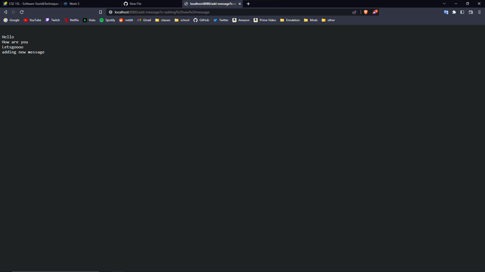

# Lab Report 2
*Lab report for weeks 2 and 3.*
## Part 1 - Web Server
> * Here is the code for the web server called StringServer, which will track incoming requests to a single string.

> * The following two screenshots are examples of me using the webserver, the first screenshot is of me before adding the new string, and the second screenshot is the result after entering the URL.

> * The method or methods that will have been called from the Handler class used in the StringServer for this first screenshot will be the HandleRequest method.
> * The relevant arguments to this method includes the URI object containing the url to be handled by the method. The relevant values for the method includes the runningString object, the URI object, as well as values for the path and query that the method will process.
> * The only relevant value that will change after running this command will be the runningString object, since it will be concatenated with a new line character and the part of the query after the "=" sign. 
> 
> *
