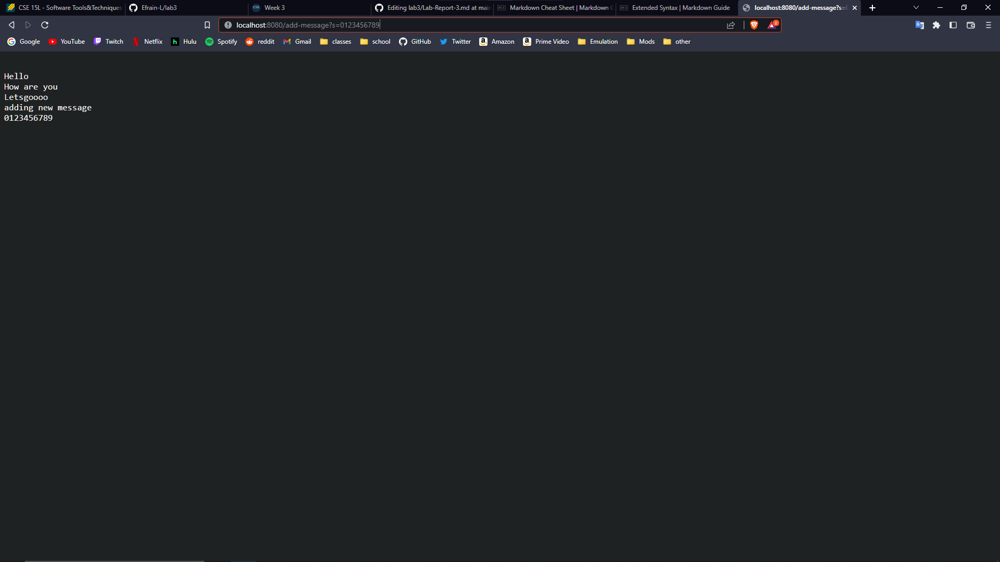

# Lab Report 2
*Lab report for weeks 2 and 3.*
## Part 1 - Web Server
> * Here is the code for the web server called StringServer, which will track incoming requests to a single string.
```java
import java.io.IOException;
import java.net.URI;

class Handler implements URLHandler {
    String runningString = new String();

    public String handleRequest(URI url) {
        if (url.getPath().equals("/")) {
            return runningString;
        } else {
            System.out.println("Path: " + url.getPath());
            if (url.getPath().contains("/add-message")) {
                String[] parameters = url.getQuery().split("=");
                if (parameters[0].equals("s")) {
                    runningString += ("\n" + parameters[1]);
                    return runningString;
                }
            }
            return "404 Not Found!";
        }
    }
}

class StringServer {
    public static void main(String[] args) throws IOException {
        if(args.length == 0){
            System.out.println("Missing port number! Try any number between 1024 to 49151");
            return;
        }

        int port = Integer.parseInt(args[0]);

        Server.start(port, new Handler());
    }
}
```
The following two screenshots are examples of me using the StringServer web server with different values.
> 
> * The method or methods that will have been called from the Handler class used in the StringServer for this first screenshot will be the HandleRequest method.
> * The relevant arguments to this method includes the URI object containing the url to be handled by the method. The relevant values for the method includes the runningString object, the URI object, as well as values for the path and query (such as `/add-message`, splitting the query and using the resulting parameters array) that the method will process.
> * The only relevant value that will change after this will be the runningString object, since it will be concatenated with a new line character and the part of the query after the "=" sign. 

> 
> * For this screenshot, the exact same methods are called, since the Handler class's method HandleRequest will be called again, this time with a different URI object being passed in. The relevant values for this example is also the same as the previous, where the runningString, URI, and path and query strings will be used.
> * The relevant arguments to this method is also the URI object which will contain the entered url. The relevant values also includes the runningString object the URI object, and the paths and queries.
> * Again, the only relevent value that will change as a result of this request will be the runningString object, which has been concatenated with the a new line and the corresponding part of the new query from the URI object argument.

## Part 2 - Bugs
> * The following *reversed* method contains one of the bugs present in the ArrayExamples.java file.
```java
  // Returns a *new* array with all the elements of the input array in reversed
  // order
  static int[] reversed(int[] arr) {
    int[] newArray = new int[arr.length];
    for(int i = 0; i < arr.length; i += 1) {
      arr[i] = newArray[arr.length - i - 1];
    }
    return arr;
  }
```
> * A failure-inducing input for this method would be an array containing the integers `[1, 2, 3, 4, 5]`, with this input, the method would actually return the original array without any modifications. 
> * The following is a test for such a failure-inducing input written as a JUnit test.
```java
@Test
public void testReversedList() {
    int[] input = {1, 2, 3, 4, 5};
    assertArrayEquals(new int[]{5, 4, 3, 2, 1}, ArrayExamples.reversed(input));
}
```
> * Y
