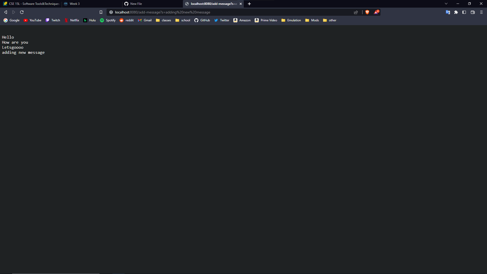
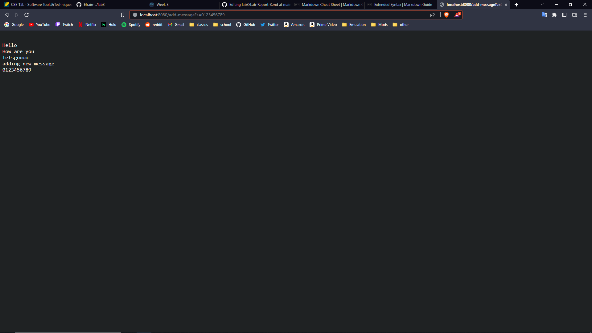
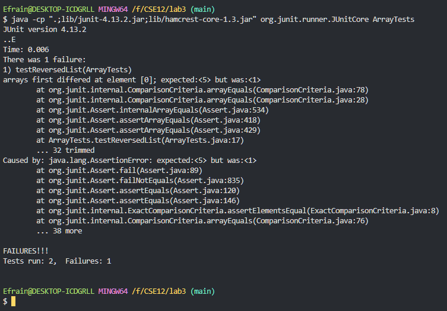

# Lab Report 2
*Lab report for weeks 2 and 3.*
## Part 1 - Web Server
* Here is the code for the web server called StringServer, which will track incoming requests to a single string.
```java
// String Server and Handler
import java.io.IOException;
import java.net.URI;

class Handler implements URLHandler {
    String runningString = new String();

    public String handleRequest(URI url) {
        if (url.getPath().equals("/")) {
            return runningString;
        } else {
            System.out.println("Path: " + url.getPath());
            if (url.getPath().contains("/add-message")) {
                String[] parameters = url.getQuery().split("=");
                if (parameters[0].equals("s")) {
                    runningString += ("\n" + parameters[1]);
                    return runningString;
                }
            }
            return "404 Not Found!";
        }
    }
}

class StringServer {
    public static void main(String[] args) throws IOException {
        if(args.length == 0){
            System.out.println("Missing port number! Try any number between 1024 to 49151");
            return;
        }

        int port = Integer.parseInt(args[0]);

        Server.start(port, new Handler());
    }
}
```
* The following two screenshots are examples of me using the StringServer web server with different values.

* The method or methods that will have been called from the Handler class used in the StringServer for this first screenshot will be the HandleRequest method.
* The relevant arguments to this method includes the URI object containing the url to be handled by the method. The relevant values for the method includes the runningString object, the URI object, as well as values for the path and query (such as `/add-message`, splitting the query and using the resulting parameters array) that the method will process.
* The only relevant value that will change after this will be the runningString object, since it will be concatenated with a new line character and the part of the query after the "=" sign. 

* For this screenshot, the exact same methods are called, since the Handler class's method HandleRequest will be called again, this time with a different URI object being passed in. The relevant values for this example is also the same as the previous, where the runningString, URI, and path and query strings will be used.
* The relevant arguments to this method is also the URI object which will contain the entered url. The relevant values also includes the runningString object the URI object, and the paths and queries.
* Again, the only relevent value that will change as a result of this request will be the runningString object, which has been concatenated with the a new line and the corresponding part of the new query from the URI object argument.

## Part 2 - Bugs
> * The following *reversed* method contains one of the bugs present in the ArrayExamples.java file.
```java
  // Returns a *new* array with all the elements of the input array in reversed
  // order
  static int[] reversed(int[] arr) {
    int[] newArray = new int[arr.length];
    for(int i = 0; i < arr.length; i += 1) {
      arr[i] = newArray[arr.length - i - 1];
    }
    return arr;
  }
```
* A failure-inducing input for this method would be an array containing the integers `[1, 2, 3, 4, 5]`, with this input, the method would actually return the original array without any modifications. 
* The following is a test for such a failure-inducing input written as a JUnit test.
```java
@Test
public void testReversedList() {
    int[] input = {1, 2, 3, 4, 5};
    assertArrayEquals(new int[]{5, 4, 3, 2, 1}, ArrayExamples.reversed(input));
}
```
* An input to the method that does not induce a failure is an array with the values `[1, 2, 1]`, since this array is the same when it is reversed, the test will pass sucessfuly.
* The corresponding JUnit test below.
```java
@Test
public void testReversedListSame() {
    int[] input = {1, 2, 1};
    assertArrayEquals(new int[]{1, 2, 1}, ArrayExamples.reversed(input));
}
```
* Here is the a screenshot of running the JUnit test via the command line demonstrating the symptom of the bug.

* The following two code blocks are a before and after from fixing the bug.
```java
  // BUGGED
  // Returns a *new* array with all the elements of the input array in reversed
  // order
  static int[] reversed(int[] arr) {
    int[] newArray = new int[arr.length];
    for(int i = 0; i < arr.length; i += 1) {
      arr[i] = newArray[arr.length - i - 1];
    }
    return arr;
  }
```
```java
  // FIXED
  // Returns a *new* array with all the elements of the input array in reversed
  // order
  static int[] reversed(int[] arr) {
    int[] newArray = new int[arr.length];
    for(int i = 0; i < arr.length; i += 1) {
      newArray[i] = arr[arr.length - i - 1];
    }
    return newArray;
  }
```
* The code change fixes the issue since the problem with the original code was that it was assigning a new array with the reversed values, but was returning the original array object. This change returns the proper array, fixing the bug.

## Part 3 - Something New
* Something new that I learned that I was not aware of before the labs in the past two weeks was the creation of a webserver in java, and how queries in website url's work. 
* I learned how Web Servers can be set up in a Java program, and how, to some extent, websites manage url requests and how the server might respond to different paths and queries entered by users, and how it can be used to determine the behavior of the site/server.
